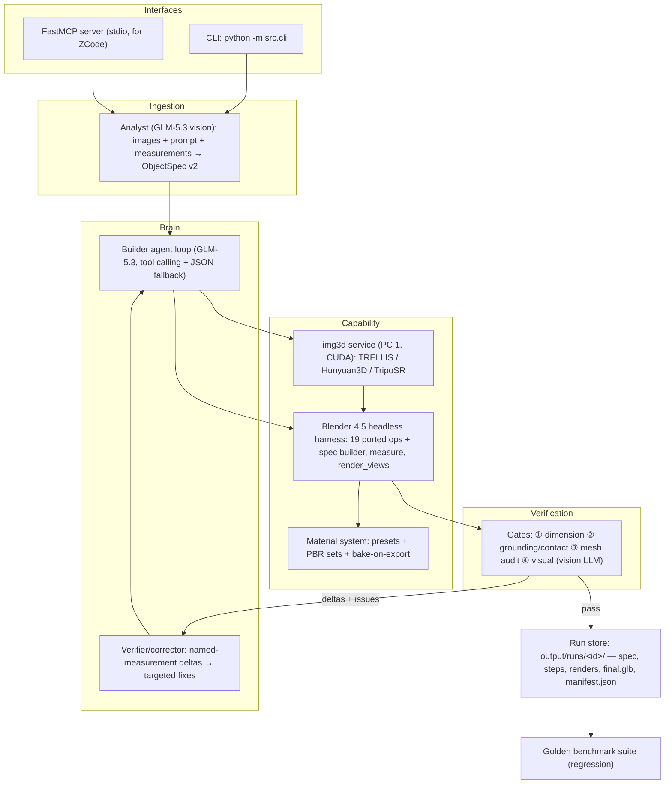

# 3D Builder — Master Plan v2

**Mission**: Generate **production-quality, measurement-accurate, textured 3D assets** from
reference images, dimension specs, and text prompts. Brain: **GLM-5.3** via the Aptos endpoint.
Hands: **Blender 4.5 headless** + **local neural image-to-3D on the RTX 4080 Super**.
Accuracy enforced by a **closed-loop verification system**. Delivered as an **autonomous CLI
agent** and a **stdio MCP server** usable from ZCode.

This plan supersedes the Gemini draft. It keeps that draft's best ideas (rich shape vocabulary,
named measurements, grounding gate, material presets) and fixes its errors — see
[Appendix A](#appendix-a-delta-vs-the-gemini-draft) for the full adopt/reject rationale.

---

## 1. Hardware & Deployment Topology

| Machine | Specs | Role |
|---|---|---|
| **PC 1 "Forge"** | RTX 4080 Super (16 GB VRAM), 64 GB RAM, Ryzen 9 9950X, Win 11 | Primary dev machine + **local inference host**. Runs Blender harness during dev, hosts the `img3d` neural service (TRELLIS / Hunyuan3D / TripoSR), and optionally a local VLM fallback (Qwen2.5-VL-7B) if the Aptos vision probe ever fails. |
| **PC 2 "Scout"** | Ryzen 5 4600H, 40 GB DDR4, GTX 1650 Ti (4 GB VRAM), Win 11 | Agent / CLI / MCP host and soak-test machine. Runs the full 3D Builder stack (Blender is CPU-bound — fine here). Calls PC 1's `img3d` service over LAN. Its 4 GB VRAM **cannot** run quality image-to-3D models — never scheduled to. |
| Phone (Honor Magic 7 Pro) | — | **Out of scope for now.** |

Key consequences of this hardware:

- **Image-to-3D is fully local and free.** The 4080 Super runs TRELLIS or Hunyuan3D-2.1
  (both fit in 16 GB). No paid third-party APIs (Meshy/Tripo) are needed — they remain an
  optional escape hatch behind the same provider interface, nothing more.
- **The neural service is a separate HTTP microservice** (`services/img3d_service`, FastAPI)
  started on PC 1. Everything else talks to it via `config/hardware.yaml`
  (`http://127.0.0.1:8501` on PC 1, LAN IP from PC 2). One code path for both machines;
  the phone can reuse the same endpoint later. Binds 127.0.0.1 by default; LAN binding is
  opt-in with a token.
- **Two Python environments, never mixed** (3DGuy's rule): the main env (agent, Blender
  runner, MCP — light deps) and the `img3d` env (PyTorch + CUDA + model weights, optional
  dependency group, installed only on PC 1).
- **Single-job GPU queue** in the service: one generation at a time, model stays loaded
  (16 GB VRAM is mostly consumed by one TRELLIS/Hunyuan3D instance).

## 2. Locked Decisions

| Decision | Choice | Why |
|---|---|---|
| Core approach | **Hybrid**: parametric-first for measured parts, neural image-to-3D for organic parts | Parametric gives exact measurements; neural covers shapes you can't declare. Per-**part** routing inside one pipeline. |
| Deliverable | **MCP server + CLI agent** | Both interfaces over the same tool layer; ZCode can drive it directly. |
| Brain | GLM-5.3 @ `https://host0.inference.aptoslabs.com/v1/` (OpenAI-compatible; vision confirmed, key in hand) | User's choice. A cheap runtime probe guards against deployment changes; fallback ladder below. |
| Language | Python ≥3.11,<3.13, uv, hatchling, `package=false` | 3DGuy conventions; Blender scripts in Python; all image-to-3D models are PyTorch; OrianBuilder's harness is embedded Python that lifts nearly verbatim. |
| DCC | Blender 4.5 headless on Windows | Exact setup 3DGuy already runs. Substance dropped (licensing; texturing-only tool). |
| Outputs | **GLB primary** (baked PBR textures); FBX/OBJ/USDZ optional | glTF is the interchange both Godot and three.js consume; see the bake rule in §6. |

## 3. Architecture



End-to-end flow for `build --image chair.jpg --measurements "..."`:

1. **Analyze** — GLM-5.3 (vision) reads all reference images (multi-view supported) + the
   measurement spec + prompt → drafts **ObjectSpec v2** (pydantic-validated, with evidence
   links back to images/measurements).
2. **Plan** — each part is routed: `parametric` (declared shape, exact dims) vs
   `image_to_3d` (organic, cropped from reference) vs `script` (escape hatch).
3. **Build** — `build_from_spec` constructs parametric geometry with the full shape
   vocabulary; organic parts are generated by the img3d service, imported, then run through
   the cleanup chain (decimate → UV → scale-to-exact-bounds → center origin).
4. **Verify (closed loop)** — `measure` reads back world-space dimensions; gates compute
   per-measurement mm deltas and grounding/mesh/visual issues; failures (including Blender
   tracebacks) feed the corrector with **explicit delta messages** until green, the
   iteration budget is spent, or the agent files an unresolved-item report.
5. **Finish** — materials applied and **baked to PBR textures on export**, origin at
   bottom-center, real-world scale, GLB (+optional formats) written to the run folder with
   manifest and preview renders.

## 4. ObjectSpec v2 (`src/spec/schema.py`)

Merged schema: Gemini's modifiers/materials/named-measurements **plus** the method routing
and evidence traceability the Gemini draft was missing. Pydantic v2, JSON-serializable.

```json
{
  "schema_name": "threed-objectspec",
  "schema_version": "2.0.0",
  "name": "Mid-century dining chair",
  "units": "meters",
  "default_tolerance_m": 0.001,
  "source": {
    "images": ["input/chair_front.jpg", "input/chair_side.jpg"],
    "prompt": "Mid-century modern dining chair, oak frame, tapered legs",
    "evidence": [
      {"id": "ev-1", "kind": "measurement", "text": "seat height 45cm"},
      {"id": "ev-2", "kind": "image", "ref": "input/chair_front.jpg"}
    ]
  },
  "parts": [
    {
      "name": "seat",
      "method": "parametric",
      "shape": "rounded_box",
      "params": {"size": [0.50, 0.48, 0.05], "bevel": 0.008, "segments": 4},
      "position": [0, 0, 0.425],
      "material": {"preset": "oak_wood", "roughness": 0.55}
    },
    {
      "name": "leg_front_left",
      "method": "parametric",
      "shape": "tapered_cylinder",
      "params": {"diameter_top": 0.045, "diameter_bottom": 0.032, "height": 0.45},
      "position": [0.21, 0.19, 0.225]
    },
    {
      "name": "backrest_slat",
      "method": "parametric",
      "shape": "box",
      "params": {"size": [0.46, 0.02, 0.12]},
      "position": [0, -0.225, 0.68],
      "modifiers": [
        {"type": "array_linear", "count": 3, "direction": [0, 0, 1], "spacing": 0.09}
      ]
    },
    {
      "name": "seat_cushion",
      "method": "image_to_3d",
      "image_crop": "input/chair_front.jpg#seat",
      "target_size": [0.48, 0.46, 0.04],
      "material": {"preset": "linen_fabric"}
    }
  ],
  "measurements": [
    {"name": "overall_height", "target": 0.85, "applies_to": "overall.z", "tolerance_m": 0.002},
    {"name": "seat_height",   "target": 0.45, "applies_to": "seat.top_z",  "tolerance_m": 0.002},
    {"name": "seat_width",    "target": 0.50, "applies_to": "seat.x",      "tolerance_m": 0.002}
  ],
  "constraints": [
    {"type": "ground_contact", "parts": ["leg_front_left", "leg_front_right", "leg_back_left", "leg_back_right"]},
    {"type": "coaxial_z", "parts": ["seat", "leg_front_left"]}
  ]
}
```

**Shape vocabulary** (typed `params` per shape — no ambiguous bare `[x,y,z]`):

| Shape | Params | Use for |
|---|---|---|
| `box` | `size` | panels, slats, frames |
| `rounded_box` | `size`, `bevel`, `segments` | cushions, housings, anything that shouldn't look CAD-blocky |
| `cylinder` | `diameter`, `height` | posts, pipes, knobs |
| `tapered_cylinder` | `diameter_top`, `diameter_bottom`, `height` | table/chair legs, lamp shades |
| `sphere` / `rounded_box` variants | `diameter` | knobs, finials |
| `revolve` | `profile: [[r, z], …]`, optional `angle_deg` | bottles, vases, turned legs, bowls — **the** quality win for symmetric objects |
| `extrude` | `profile: [[x, y], …]`, `height`, optional `taper_ratio` | brackets, custom footprints, hand-drawn profiles |
| `sweep` | `path: [[x, y, z], …]`, `section: {shape, diameter|size}` | cables, curved tubular frames, handles |

**Modifiers**: `bevel`, `array_radial {count, axis}` (spokes, gear teeth, star bases),
`array_linear {count, direction, spacing}`, `mirror {axis}`, `subdivision {levels}`,
`smooth_shade`, `boolean_difference {tool: <inline part spec>}` (slots, mortises, hollows).

**Part methods**: `parametric` | `image_to_3d` (organic; cropped from a reference image,
scaled to `target_size`) | `script` (agent-authored Python via the reviewed `run_script`
escape hatch — same explicit trust model as OrianBuilder).

**Materials**: `{preset, base_color, roughness, metallic, texture_set}` — presets from §6,
`texture_set` points at a folder of PBR maps.

## 5. Blender Harness (`src/blender/`)

**Ported from OrianBuilder, protocol unchanged** (proven in production there):
one process per op (`blender --background --factory-startup --python harness.py -- request.json`),
arguments via JSON temp file (immune to quoting and to the space in "3D Builder"),
results framed between stdout sentinels, tracebacks returned as structured errors so the
agent can self-correct.

- **All 19 existing ops lift as-is**: `info`, `import_model`, `export_model`, `convert`,
  `inspect`, `decimate`, `smooth_shade`, `generate_uvs`, `apply_material`, `bake_textures`,
  `auto_rig`, `add_animation`, `retarget_animation`, `create_primitive`, `combine_meshes`,
  `scale_to_size`, `center_origin`, `render_preview`, `run_script`.
- **`scale_to_size` extended** → `scale_to_exact_bounds`: per-axis (anisotropic) option for
  neural meshes that must hit `target_size` on all three axes.
- **New ops**:
  - `build_from_spec` — constructs the full part list (shapes, modifiers, materials,
    constraints) with exact dimensions; every part named for downstream measurement.
  - `measure` — world-space bounding dimensions **per named part** + overall + distance to
    ground, in meters, as JSON. Feeds the dimension and grounding gates.
  - `render_views` — `front` / `side` / `top` / `iso` studio renders (key/fill/rim lights,
    transparent background, configurable resolution) for the visual gate.
  - `set_units` — scene unit scale to meters.
  - `apply_material_preset` / `bake_materials` — see §6.
- **`locate.py`** — port of OrianBuilder `locate.ts`: `THREED_BLENDER` env var → PATH →
  Program Files sweep (versioned dirs, newest first; includes 3DGuy's Blender 4.5 path),
  version parse, 3.3+ check.

## 6. Material System (`src/materials/`)

**The rule Gemini's plan broke**: procedural node shaders and tri-planar mappings **do not
survive glTF export** — Godot/three.js cannot evaluate Blender shader graphs, so an unbaked
"beautifully textured" model exports flat grey. Every asset therefore gets **baked to PBR
texture maps on export** (the ported `bake_textures` op exists for exactly this reason).

1. **Procedural presets** (Blender nodes; used for preview and as bake sources):
   fine wood (dual-frequency Voronoi grain), brushed metal (anisotropic roughness),
   matte/glossy polymers, leather (Voronoi normal bump), fabric sheen, glass (IOR 1.45).
2. **External PBR texture sets**: point a part at a folder of
   `{albedo,normal,roughness,metallic,ao}` maps; UVs smart-projected if the mesh has none.
3. **Bake-on-export**: `bake_materials` runs before final GLB export; baked maps are stored
   in the run folder and referenced by the GLB. Renders and the GLB always agree.
4. **Distinct material slots per part** — free byproduct: any external texturing tool
   (including Substance, if ever licensed) can paint by ID. No Substance-specific workflow.

## 7. Agent (`src/agent/`)

- **Provider**: `AptosGLMProvider` implements 3DGuy's `AIProvider` ABC (`health()`,
  `complete_json()`) plus chat-with-tools. OpenAI SDK pointed at the Aptos base URL; key
  from `THREED_API_KEY` env; model/base URL in `config/ai.yaml` (env-overridable).
  Every call is inference-logged (3DGuy pattern).
- **Vision ladder** (not a hard dependency on any one claim):
  1. Runtime probe: tiny image chat test against GLM-5.3 at startup.
  2. If the endpoint ever rejects images → local **Qwen2.5-VL-7B** on PC 1's 4080 Super
     (fits in 16 GB) as the vision critic, same provider interface.
  3. If no GPU available → text-description mode: user describes the reference; the agent
     still builds accurately from measurements alone.
- **Tool calling with fallback**: native OpenAI function calling first; if the vLLM
  deployment proves flaky, the same loop degrades to a JSON protocol
  (`{"tool": "...", "args": {...}}` emitted as plain text). Abstracted from day one.
- **Tools exposed to the model**: `analyze_images`, `write_spec`, `validate_spec`,
  `build_from_spec`, `run_blender_op` (every op), `run_script`, `measure`, `render_views`,
  `apply_material`, `bake_materials`, `image_to_3d`, `read_run_artifact`,
  `report_unresolved`, `finish`.
- **Roles** (3DGuy pattern): **analyst** (images + measurements → spec),
  **builder** (spec → geometry, tool loop), **verifier/corrector** (gate deltas → targeted
  fixes, e.g. *"seat_height is 0.46 m, target 0.50 m, Δ −40 mm — raise seat by 0.04 m"*).
- **Budgets**: max iterations, token budget, and wall-clock cap from `config/defaults.yaml`.
  On exhaustion → unresolved-item report in the manifest (3DGuy's `UnresolvedItem` pattern)
  instead of silent failure.

## 8. Verification Gates (`src/spec/validation.py`, `src/agent/vision.py`)

1. **Dimension gate (hard)** — every *named* measurement checked against `measure` output;
   per-measurement tolerance (default ±1 mm); failures produce explicit delta messages.
2. **Grounding & contact gate (hard)** — declared ground-contact parts touch Z = 0
   ±0.5 mm; no part floats (unexplained gap to ground or to its neighbors); penetrations
   flagged.
3. **Mesh audit (hard)** — trimesh: watertight/manifold, no degenerate faces, correct
   normal orientation, triangle budget (default 100k, configurable), UVs present when
   textured, real-world scale sanity. *(No automatic "quad retopology" — that problem is
   unsolved; promising it would be fantasy. Decimate + shade-smooth + optional remesh only.)*
4. **Visual gate (advisory)** — vision LLM compares 4-view renders against reference
   images; returns a verdict + issue list, recorded in the manifest.

All gate results land in `output/runs/<id>/manifest.json`; `passed: true` marks the final
GLB (3DGuy's generation-authorization pattern).

## 9. Image-to-3D Service (`services/img3d_service/`, PC 1)

- **`ImageTo3DProvider` ABC** in `src/img3d/provider.py`; the service and any future
  third-party API are interchangeable implementations selected in `config/hardware.yaml`.
- **Model bake-off at M4 on the 4080 Super**, scored on the golden benchmark set:
  - **TRELLIS** — best geometry quality, textured output, fits 16 GB. Implemented
    as TRELLIS.2-4B via trellis.cpp (MIT C++/GGML port: prebuilt Windows CUDA
    server + GGUF weights under `models/trellis/`) — the reference Python repo
    is Linux-only with CUDA-toolkit submodules.
  - **Hunyuan3D-2.1** — strongest PBR textures, ~12 GB.
  - **TripoSR** — fastest/lightest (~6 GB), lower quality; kept as the low-VRAM fallback.
- **Service shape**: FastAPI on PC 1 (`/health`, `/generate` → job id, `/result/<id>`),
  single-job GPU queue, model loaded once, weights cached under `models/`. The Windows-side
  agent talks to it via httpx; PC 2 points at PC 1's LAN address.
- **Neural mesh post-processing** (always): import → decimate to budget → smart UV →
  `scale_to_exact_bounds(target_size)` → `center_origin` → material/bake. Neural output is
  never shipped raw.
- **Windows-native PyTorch/CUDA** (both PCs are Win 11); WSL2 only if a chosen model's
  dependencies force it. Heavy deps live in the optional `[img3d]` dependency group,
  installed only on PC 1.

## 10. Interfaces

**CLI** (`python -m src.cli …`, Typer + rich output):

```
build --image ref.jpg [--image side.jpg] --measurements "seat 50x50cm, height 95cm" [--prompt "..." --material oak_wood]
build --spec input/chair.spec.json
measure <glb>                     # per-part + overall dimensions
render <glb> --views front,side,top,iso --resolution 1024
apply-material <glb> --preset oak_wood | --texture-set dir/
mcp                               # run the FastMCP stdio server
runs list | runs show <id>
presets                           # list material presets
```

**MCP server tools** (FastMCP, stdio — ZCode can drive everything):
`generate_3d_model(prompt, measurements, image_paths, material_preset, tolerance_mm)`,
`build_from_spec(spec_json)`, `measure_3d_model(glb_path)`, `render_3d_model(glb_path, views)`,
`apply_pbr_material(glb_path, preset_or_textures)`, `image_to_3d(image_path, target_size)`,
`list_presets()`, `list_runs()`, `get_run(run_id)`.

## 11. Run Store & Golden Benchmarks

- **Run store** (`src/run_store.py`): `output/runs/<run-id>/` containing `spec.json`,
  `steps/step-N.glb` (every build iteration), `renders/`, `final.glb`, `manifest.json`
  (gates, deltas, inference log refs, unresolved items), `baked/` (PBR maps).
- **Golden benchmark suite** (`benchmarks/`, 3DGuy's `benchmarks/planspec-ai` pattern):
  a fixed set of cases — chair, table, bottle/vase (revolve), mug with handle (sweep +
  boolean), one organic (image-to-3D) — each with reference images, a spec, and expected
  measurements. Run as regression after any change to prompts, schema, or harness;
  dimension-gate pass rate and visual scores tracked over time. This is how "best possible
  output" stays best instead of regressing silently.

## 12. Repository Layout

```
3D Builder/
├── README.md / AGENTS.md / PLAN.md
├── pyproject.toml                # uv, hatchling, package=false; [img3d] optional group (PC 1 only)
├── config/
│   ├── defaults.yaml             # tolerances, tri budget, render, cleanup, agent budgets
│   ├── ai.yaml                   # base_url, model, api_key_env, tool-call mode
│   └── hardware.yaml             # role, img3d service URL, LAN/auth options
├── src/
│   ├── ai/                       # provider ABC, aptos provider, inference log
│   ├── spec/                     # schema v2, resolver, validation (gates)
│   ├── blender/                  # locate, harness, runner, build_ops
│   ├── materials/                # presets, PBR sets, bake orchestration
│   ├── agent/                    # loop, tools, prompts, vision
│   ├── img3d/                    # provider ABC + service client
│   ├── pipeline.py               # end-to-end orchestration
│   ├── run_store.py
│   ├── cli.py
│   └── mcp_server.py
├── services/img3d_service/       # FastAPI GPU service (PC 1): app, queue, model providers
├── benchmarks/                   # golden cases (specs + images + expected measurements)
├── scripts/                      # blender-smoke.ps1, start-img3d.ps1, run-benchmarks.ps1
├── input/                        # reference images + measurement specs
├── output/runs/<run-id>/
└── tests/
```

## 13. Milestones (tests green at every exit — never a final "testing phase")

- **M0 — Environment proof.** Scaffold repo; `locate.py`; harness port; smoke script runs
  `info` + `create_primitive` + `render_preview`. *Exit: smoke green on this machine
  (confirms Blender 4.5 present); pytest scaffold runs.*
- **M1 — Deterministic core (no AI).** ObjectSpec v2 + resolver; `build_from_spec` with the
  full shape vocabulary + modifiers; `measure`, `render_views`, `set_units`; dimension +
  grounding + mesh gates; run store; CLI `build --spec`. *Exit: spec JSON in → verified GLB
  out on a golden case; pytest green (schema, resolver, gates).*
- **M2 — Agent end-to-end.** Aptos provider + vision probe; tool loop with JSON fallback;
  analyst/builder/verifier prompts; delta corrector; `build --image/--prompt/--measurements`.
  *Exit: reference image + measurements → GLB with dimension gate green on golden cases
  (needs `THREED_API_KEY`).*
- **M3 — Interfaces, materials, benchmarks.** FastMCP server; procedural presets + PBR set
  loading + bake-on-export; multi-format export; golden benchmark harness wired to CI-style
  script; docs. *Exit: ZCode drives a build via MCP; benchmark report generated.*
- **M4 — Neural organic leg.** img3d service on PC 1; TRELLIS vs Hunyuan3D-2.1 bake-off on
  the golden set; `image_to_3d` tool + cleanup chain + `scale_to_exact_bounds`; hybrid
  routing in specs. *Exit: organic part generated from a cropped reference, scaled to
  measured dims, passing mesh + dimension gates.*

## 14. Risks & Mitigations

| Risk | Mitigation |
|---|---|
| vLLM tool-calling flakiness | JSON-protocol fallback built into the loop abstraction from day one |
| Aptos vision claim wrong at runtime | Startup probe → local Qwen2.5-VL on the 4080 → text-description mode; agent remains functional from measurements alone |
| Procedural shaders lost on GLB export | Bake-on-export is a hard gate, not a step someone can forget (§6) |
| `run_script` runs LLM-authored Python | Same explicit, user-authorized trust model as OrianBuilder; typed ops are the default path; scripts land in the run folder for audit |
| Path contains a space ("3D Builder") | JSON temp-file args + list-form subprocess calls, never shell strings |
| 16 GB VRAM contention on PC 1 | Single-job queue in the img3d service; VLM fallback only loads when the probe fails |
| Model choice uncertainty (TRELLIS vs Hunyuan) | Provider ABC + M4 bake-off scored on the golden set; TripoSR as low-VRAM fallback |
| Quality regressions over time | Golden benchmark suite run on every change; scores tracked in manifests |

## 15. Out of Scope (for now)

Substance workflow · web UI (3DGuy's lab pattern maps 1:1 later if wanted) ·
animation/rigging (harness `auto_rig` already exists if needed) · phone client ·
automatic quad retopology (unsolved problem; not promised).

---

## Appendix A — Delta vs the Gemini Draft

**Adopted** (genuinely better than v1):
rich shape vocabulary (revolve/taper/sweep/boolean/arrays/bevels) · named measurements with
`applies_to` + per-measurement tolerance + explicit delta feedback · grounding/contact gate ·
procedural material presets + PBR set loading · `--prompt`/`--material` CLI flags ·
mermaid architecture diagram.

**Rejected / corrected** (with reasons):
1. *"Vision failed on text-only GLM-5.3 → use GPT-4o/Claude critics"* — contradicts the
   confirmed working vision + key; adds external dependencies the user didn't ask for.
   Replaced by the probe → local Qwen2.5-VL → text ladder (§7).
2. **No image-to-3D component at all** — the user explicitly chose hybrid; the draft's
   "Neural Mesh Importer" had no model, no VRAM plan, no service design. Restored as §9,
   now fully local on the 4080 Super.
3. **glTF export bug** — tri-planar/procedural node shaders do not survive GLB export;
   without baking, every textured asset ships flat grey. Fixed by the §6 bake rule.
4. **No reuse of existing assets** — ignored the proven OrianBuilder harness protocol and
   3DGuy patterns (provider ABC, run store, gates, evidence). Rebuilding from scratch would
   add risk and time for zero gain.
5. **No hardware strategy** — said nothing about the two PCs; the 4 GB GTX 1650 Ti would
   have been scheduled for work it can't do. Fixed by §1.
6. **Risk-backwards sequencing** — materials before the agent, interfaces near the end,
   tests as a final phase. Reordered: deterministic core → agent end-to-end (the risky
   integration) → interfaces/materials → neural leg; tests green at every milestone exit.
7. **Scope fantasies** — "quad-friendly retopology" (unsolved), OpenCV contour blueprint
   detector (a vision LLM reads drawings better than hand-rolled CV), three separate
   pipelines (one pipeline with per-part routing — the draft's own schema had no `method`
   field to route with), Substance Painter export framing after Substance was dropped for
   licensing.
8. **Missing essentials** — no JSON-protocol fallback, no run manifest/inference-log
   design, no risk table, no auth/env config, no regression benchmarks, no space-in-path
   handling.
